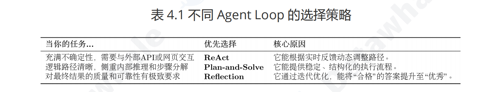

# ReAct -> Reasoning and Acting && Thought -> Action -> Observation

.env baseurl apikey model timeout 
llm_client.py 
class HelloAgentsLLM:
"""
为本书 "Hello Agents" 定制的LLM客户端。
它用于调用任何兼容OpenAI接口的服务，并默认使用流式响应。
"""

    init 初始化client
    """
    初始化客户端。优先使用传入参数，如果未提供，则从环境变量加载。
    """

    think 参数messages: List[Dict[str,str]] -> str 
    流式打印 并 返回完整内容


tools.py
	def search(query: str) -> str:
	"""
    一个基于SerpApi的实战网页搜索引擎工具。
    它会智能地解析搜索结果，优先返回直接答案或知识图谱信息。
    """
    class ToolExecutor:
    """
    一个工具执行器，负责管理和执行工具。
    """
    	def init:
    	tools: Dict[str,Dict[str,Any]]


    	def registerTool(name: str, description: str, func: callable):
    	"""
        向工具箱中注册一个新工具。
        """
        检查name是否在tools,覆盖，注册


        def getTool(name: str) -> callable:
        """
        根据名称获取一个工具的执行函数
        """

        def getAvailableTools() -> str:
        """
        获得所有可用工具的格式化描述字符串
        """

ReAct.py
	REACT_PROMPT_TEMPLATE = """
	请注意，你是一个有能力调用外部工具的智能助手。

	可用工具如下：
	{tools}

	请严格按照以下格式进行回应：

	Thought: 你的思考过程，用于分析问题、拆解任务和规划下一步行动。
	Action: 你决定采取的行动，必须是以下格式之一：
	- `{{tool_name}}[{{tool_input}}]`：调用一个可用工具。
	- `Finish[最终答案]`：当你认为已经获得最终答案时。
	- 当你收集到足够的信息，能够回答用户的最终问题时，你必须在`Action:`字段后使用 `Finish[最终答案]` 来输出最终答案。


	现在，请开始解决以下问题：
	Question: {question}
	History: {history}
	"""
	class ReActAgent:
		def __init__(llm_client:, tool_executor:, max_steps:):


		def run(question: str):
		循环
		prompt
		messages
		llm_client.think
		解析response_text
		判空 Observation

		Finish

		Action: tool_name
		判空 Observation
		not in tools Observation
		执行 Observation


		def _parse_output(text: str):
		解析Thought Action
		Thought: 解析Thought到Action或末尾
		Action: 末尾
		return 只有对应内容

		def _parse_action_input(action_text: str):
		
		def _parse_action(action_text: str):


-----------------------------------------------------------------------------------------
# plan and solve  plan solve  agent


# --- 2. 规划器 (Planner) 定义 ---
PLANNER_PROMPT_TEMPLATE = """
你是一个顶级的AI规划专家。你的任务是将用户提出的复杂问题分解成一个由多个简单步骤组成的行动计划。
请确保计划中的每个步骤都是一个独立的、可执行的子任务，并且严格按照逻辑顺序排列。
你的输出必须是一个Python列表，其中每个元素都是一个描述子任务的字符串。

问题: {question}

请严格按照以下格式输出你的计划，```python与```作为前后缀是必要的:
```python
["步骤1", "步骤2", "步骤3", ...]
```
"""


# --- 3. 执行器 (Executor) 定义 ---
EXECUTOR_PROMPT_TEMPLATE = """
你是一位顶级的AI执行专家。你的任务是严格按照给定的计划，一步步地解决问题。
你将收到原始问题、完整的计划、以及到目前为止已经完成的步骤和结果。
请你专注于解决“当前步骤”，并仅输出该步骤的最终答案，不要输出任何额外的解释或对话。

# 原始问题:
{question}

# 完整计划:
{plan}

# 历史步骤与结果:
{history}

# 当前步骤:
{current_step}

请仅输出针对“当前步骤”的回答:
"""


Plan_and_solve.py
load_dotenv()

class Planner:
	def __init__(llm_client):

	def plan(question) -> :
		prompt
		llm_client.think
		除去```python ``` /n
		plan = ast.literal_eval(plan_str)
		判断是否已经转成list, else []
		except e, []

class Executor:
	def __init__(llm_client):

	def execute(question: str, plan: list[str]) -> str:
		history
		enumerate(plan)
		print
		prompt  history else '无'
		messages
		think
		history += f"步骤{}: {}\n结果： {}\n\n"
		print

class PlanAndSolveAgent:
	def __init__(llm_client):

	def run(question: str):
		begin
		plan
		判空 return
		solve
		end


-----------------------------------------------------------------------------------------
# Reflection  初始执行->反思->优化->反思...
Reflection.py


# --- 模块 2: Reflection 智能体 ---

# 1. 初始执行提示词
INITIAL_PROMPT_TEMPLATE = """
你是一位资深的Python程序员。请根据以下要求，编写一个Python函数。
你的代码必须包含完整的函数签名、文档字符串，并遵循PEP 8编码规范。

要求: {task}

请直接输出代码，不要包含任何额外的解释。
"""

# 2. 反思提示词
REFLECT_PROMPT_TEMPLATE = """
你是一位极其严格的代码评审专家和资深算法工程师，对代码的性能有极致的要求。
你的任务是审查以下Python代码，并专注于找出其在**算法效率**上的主要瓶颈。

# 原始任务:
{task}

# 待审查的代码:
```python
{code}
```

请分析该代码的时间复杂度，并思考是否存在一种**算法上更优**的解决方案来显著提升性能。
如果存在，请清晰地指出当前算法的不足，并提出具体的、可行的改进算法建议（例如，使用筛法替代试除法）。
如果代码在算法层面已经达到最优，才能回答“无需改进”。

请直接输出你的反馈，不要包含任何额外的解释。
"""

# 3. 优化提示词
REFINE_PROMPT_TEMPLATE = """
你是一位资深的Python程序员。你正在根据一位代码评审专家的反馈来优化你的代码。

# 原始任务:
{task}

# 你上一轮尝试的代码:
{last_code_attempt}

# 评审员的反馈:
{feedback}

请根据评审员的反馈，生成一个优化后的新版本代码。
你的代码必须包含完整的函数签名、文档字符串，并遵循PEP 8编码规范。
请直接输出优化后的代码，不要包含任何额外的解释。
"""


class Memory:
	一个简单的短期记忆模块，用于存储智能体的行动与反思轨迹
	def __init__():
		records: List[Dict[str, Any]]

	def add_record(record_type: str, content: str):
		向记忆中添加一条新记录。
        参数:
        - record_type (str): 记录的类型 ('execution' 或 'reflection')。
        - content (str): 记录的具体内容 (例如，生成的代码或反思的反馈)。
        append print

    def get_trajectory() -> str:
    	将所有记忆记录格式化为一个连贯的字符串文本，用于构建提示词。
    	trajectory = ""
    	return

    def get_last_execution() -> str:
    	获取最近一次的执行结果
    	reversed() None

class ReflectionAgent:
	def __init__(llm_client, max_iterations):

	def run(task: str):
		begin --- task
		初始执行
		initial_prompt
		initial_code = _get_llm_response()
		add_record

		for 
		print
		反思
		last_code
		reflect_prompt
		feedback
		add_record

		校验是否停止

		优化
		print
		refine_prompt
		refined_code = 
		add_record

	final_code
	print
	return

